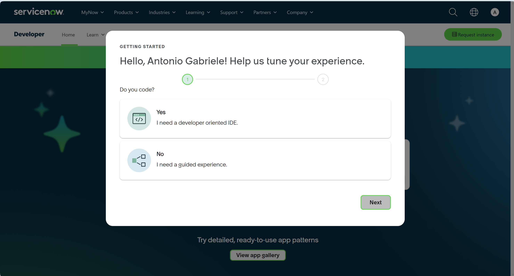
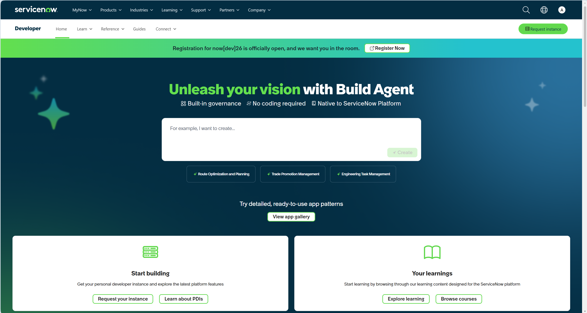
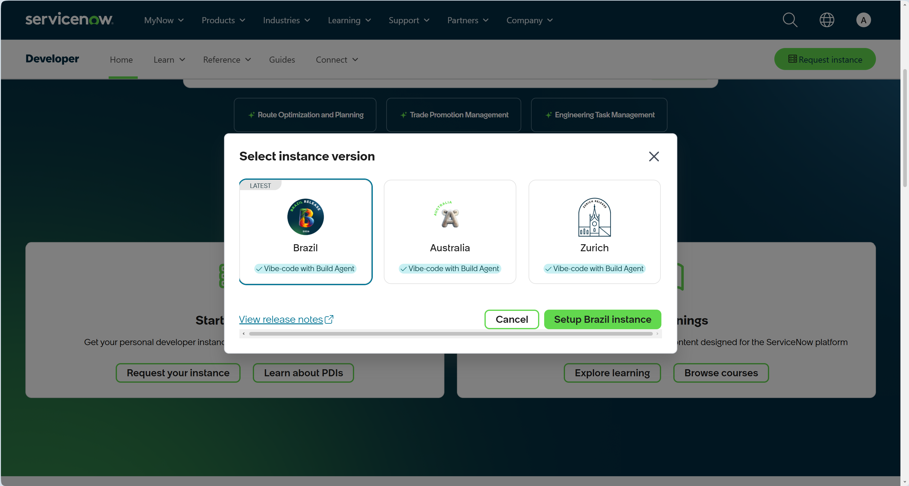
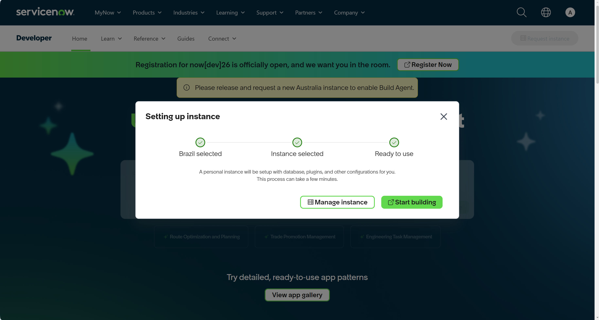
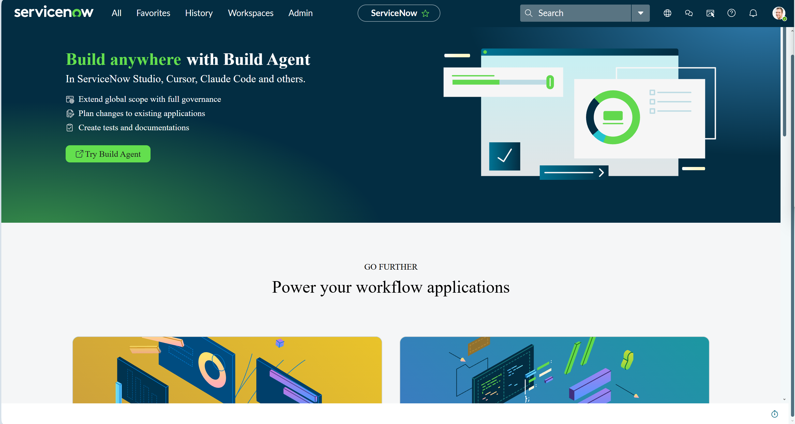
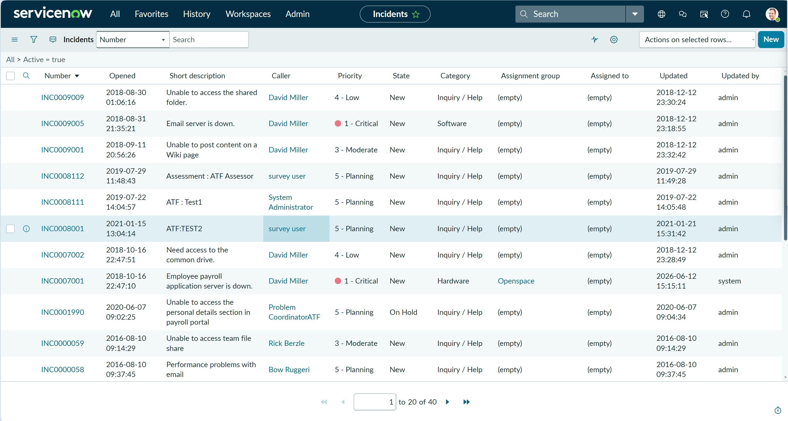
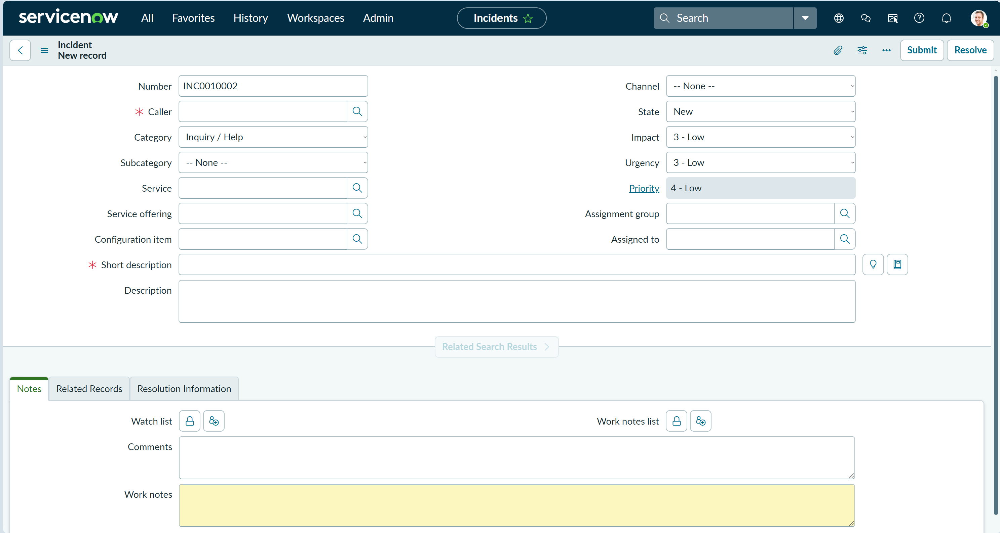

# 01 – ServiceNow Developer Instance Setup and Configuration

## Introduction

A Service Desk Analyst needs to be comfortable working inside an IT Service Management (ITSM) platform, not simply understanding ticketing concepts theoretically.

For this project, ServiceNow is used as the primary ticket-management platform. This first chapter establishes the ServiceNow Personal Developer Instance (PDI) that will be used for the practical Service Desk exercises in the following chapters.

The objective of this chapter is **configuration and environment preparation only**. No simulated user incident is handled here.

The practical incident workflow begins in Chapter 2.

---

## Objectives

By completing this chapter, the lab environment will:

- Have an active ServiceNow Developer account.
- Have a Personal Developer Instance (PDI).
- Have a usable ServiceNow environment.
- Provide access to the Incident application.
- Provide access to the Incident list.
- Provide access to the New Incident form.
- Be ready for realistic Service Desk incident simulations.

---

## Prerequisites

Before starting this chapter, ensure you have:

- A ServiceNow Developer account.
- Access to the ServiceNow Developer website.
- A modern web browser.
- Internet connection.
- Sufficient time to complete the Personal Developer Instance provisioning process.

No production ServiceNow environment is required. This chapter uses a ServiceNow Personal Developer Instance (PDI) for portfolio and practical learning purposes.

---

## ServiceNow Personal Developer Instance

A ServiceNow Personal Developer Instance (PDI) provides an individual ServiceNow environment for development, learning and practical experimentation.

For this project, the PDI is used as the working ServiceNow environment for the Service Desk exercises that follow.

The chapter deliberately focuses on establishing and verifying the environment rather than handling a simulated incident. Incident handling begins in Chapter 2.

---

## 1. ServiceNow Developer Onboarding

The ServiceNow Developer site was opened and the initial onboarding process was started.

The Developer onboarding process establishes the account and developer-oriented environment used to access the Personal Developer Instance.



During the onboarding questionnaire, the option **Yes – I need a developer oriented IDE** was selected because the account is being used for a practical technical lab environment.

The onboarding process was then completed.

> **Note:** The onboarding choices are only used to configure the developer experience. They do not represent a professional ServiceNow developer role. The purpose of this lab is Service Desk Analyst preparation.

---

## 2. ServiceNow Developer Home

After onboarding, the ServiceNow Developer home page was displayed.



The page provides access to the personal developer instance and learning resources.

Depending on the browser window size, the **Start building** and **Your learnings** sections may not initially be visible. If they are not visible, scroll down the page until the sections appear.

For this project, the important option is the personal developer instance.

---

## 3. Requesting the Personal Developer Instance

The **Request your instance** option was selected.

ServiceNow then displayed the available instance releases.



The **Brazil** release was selected from the available release options.

The selected release determines the ServiceNow version used by the Personal Developer Instance. For this laboratory, Brazil was the release selected during provisioning.

The instance was then requested using the ServiceNow setup process.

The setup process creates a personal ServiceNow environment with its database, plugins and other required configuration.

The temporary configuration/progress screen was not retained as portfolio evidence because it does not add useful information to the completed procedure.

---

## 4. Personal Developer Instance Ready

After the setup completed, ServiceNow confirmed that the instance was ready.



The **Start building** option was used to enter the new instance.

---

## 5. ServiceNow Personal Developer Instance

The ServiceNow instance home page was then displayed.


This is the working ServiceNow environment that will be used for the Service Desk practical exercises.

The ServiceNow interface provides the navigation and applications required to work with incidents.

---

## 6. Finding the Incident Application

The ServiceNow **Application Navigator** was opened.

The filter was used to search for:

`incident`



The search returned the Incident-related applications and modules available through the Application Navigator.

The **Incidents** option under Service Desk was selected.

This confirmed that the Service Desk incident-management area was available before beginning the practical incident exercises.

---

## 7. Incident List

The Incident list was opened.



The Incident list provides the central view of existing incidents.

Important fields visible in the list include:

- Incident number
- Opened date/time
- Short description
- Caller
- Priority
- State
- Category
- Assignment group
- Assigned to
- Updated
- Updated by

This is the type of working view a Service Desk Analyst uses to locate, review and manage incidents.

> **Demonstration data:** Names and other identities visible in this ServiceNow screen are ServiceNow demonstration/synthetic data. They are not real customer or employee records used by this portfolio.

---

## 8. New Incident Form

The **New** option was selected to open the Incident creation form.



The form provides the fields required to create and manage an incident.

Important fields include:

### Caller

The person reporting the issue.

### Category

The broad classification of the incident.

### Subcategory

A more specific classification beneath the category.

### Short description

A concise summary of the user's problem.

### Description

Detailed information about the reported issue.

### Channel

The method through which the incident was reported.

### State

The current state of the incident.

### Impact

The extent to which the issue affects users or the organisation.

### Urgency

How quickly the incident requires attention.

### Priority

The resulting priority used to determine how the incident should be handled.

### Assignment group

The team responsible for handling the incident.

### Assigned to

The individual analyst responsible for the ticket.

### Comments

Customer-facing communication associated with the incident.

### Work notes

Internal technical notes used by support staff to document investigation and actions.

The exact information entered into these fields will depend on the incident reported by the user. That practical decision-making process is deliberately left for Chapter 2.

---

At this stage, the environment had been tested through the normal ServiceNow navigation path rather than simply confirming that the instance opened.

The verification sequence was:

```text
ServiceNow Developer
        │
        ▼
Personal Developer Instance
        │
        ▼
Application Navigator
        │
        ▼
Incident
        │
        ├── Incident list
        │
        └── New Incident form
```


---

## Practical Activities Completed

This chapter provided hands-on experience with:

- ServiceNow Developer onboarding
- Personal Developer Instance creation
- ServiceNow navigation
- Application Navigator
- Incident application
- Incident list
- New Incident form
- Basic ServiceNow incident-field recognition

The purpose was not to learn every ServiceNow feature. The objective was to establish a usable working environment quickly so that practical Service Desk scenarios can be performed.

---

## Key Learnings

1. A ServiceNow Personal Developer Instance provides a practical environment for learning and demonstrating ServiceNow workflows.
2. The Application Navigator provides a fast way to locate applications and modules.
3. The Incident list is the working view for existing incidents.
4. The New Incident form contains the information required to document and manage a reported issue.
5. Customer-facing comments and internal work notes have different purposes.
6. Impact, urgency and priority are distinct incident-management concepts and will need to be applied correctly during the practical scenarios.

---

## Skills Demonstrated

- ServiceNow navigation
- Service Desk application discovery
- Incident management interface
- Ticket-field recognition
- IT Service Management (ITSM) workflow awareness
- Technical documentation
- Practical Service Desk preparation

---

## Interview Relevance

This lab provides a practical demonstration that the candidate has not only studied Service Desk concepts but has also worked through a ServiceNow environment and understands the basic structure of an incident record.

The experience should be described accurately as **hands-on lab practice**, not commercial ServiceNow production experience.

---

## Chapter Summary

The ServiceNow Personal Developer Instance has been successfully established and the Incident management environment has been verified.

The following components have been confirmed:

- Developer account and Personal Developer Instance
- ServiceNow working environment
- Application Navigator
- Incident application
- Incident list
- New Incident form

The environment is now ready for the next stage:

> **Receive a simulated user contact and handle the incident as a Service Desk Analyst.**

That practical workflow begins in:

**02 – Service Desk Incident Simulation**
